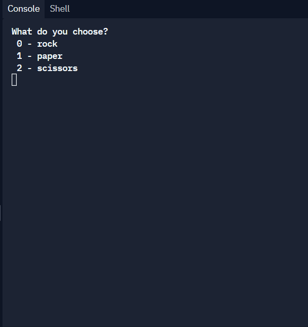

# Welcome to Rock Paper Scissors! 

Start the game by asking the player:
"What do you choose? Type 0 for Rock, 1 for Paper or 2 for Scissors."
From there you will need to figure out:
How you will store the user's input.
How you will generate a random choice for the computer.
How you will compare the user's and the computer's choice to determine the winner (or a draw).
And also how you will give feedback to the player.
You can find the "official" rules of the game on the World Rock Paper Scissors Association website.

```python
import random

rock = '''
    _______
---'   ____)
      (_____)
      (_____)
      (____)
---.__(___)
'''

paper = '''
    _______
---'   ____)____
          ______)
          _______)
         _______)
---.__________)
'''

scissors = '''
    _______
---'   ____)____
          ______)
       __________)
      (____)
---.__(___)
'''

game_images = [rock, paper, scissors]

choice = int(input("What do you choose? \n 0 - rock \n 1 - paper \n 2 - scissors \n"))

if choice >= 3 or choice < 0:
    print("Wrong entry!")
else:  
    print(game_images[choice])

    computer_choice = random.randint(0, 2)
    print(f"Computer chose:")
    print(game_images[computer_choice])

    if choice == 0 and computer_choice == 2:
        print("You won!")
    elif choice == 1 and computer_choice == 0:
        print("You won!")
    elif choice == 2 and computer_choice == 1:
        print("You won!")
    elif choice == 0 and computer_choice == 1:
        print("Computer won!")
    elif choice == 1 and computer_choice == 2:
        print("Computer won!")
    elif choice == 2 and computer_choice == 0:
        print("Computer won!")
    elif computer_choice == choice:
        print("It's a draw. Nobody wins.")
```

## Link to repl.it



https://replit.com/@AnastasiaLunina/4-rockpaperscissors#main.py
