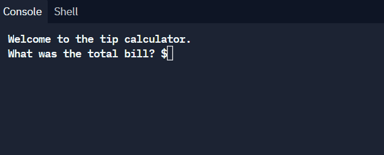

# Welcome to Tip Calculator! 

```python
print("Welcome to the tip calculator.")

total_bill = float(input("What was the total bill? $"))
percentage = int(input("What percentage tip would you like to give? 10, 12 or 15? "))
total_people = int(input("How many people to split the bill? "))

outcome = round(((total_bill) + (total_bill * (percentage/100)))/total_people, 2)

# outcome = round((((percentage / 100 * total_bill + total_bill))/total_people), 2)

print(f"Each person should pay ${outcome}")
```

## Link to repl.it



https://replit.com/@AnastasiaLunina/2-Tip-Calculator#main.py
