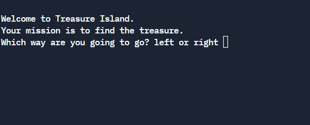

# Welcome to Treasure Island! 

```python
print("Welcome to Treasure Island.")
print("Your mission is to find the treasure.") 

direction = input("Which way are you going to go? left or right ").lower()

if direction == "right":
    print("Game over. You fell into a hole")
elif direction == "left":
    action = input("Would you rather swim or wait? ").lower()
    if action == "swim":
        print("Oops, you were attacked by trout. Game over")
    elif action == "wait":
        choice = input("Which door would you choose? red, blue or yellow? ").lower()
        if choice == "yellow":
            print("You win!")
        if choice == "blue":
            print("Eaten by beasts! Game over")
        if choice == "red":
            print("Burned by fire! Game over")

```

## Link to repl.it



https://replit.com/@AnastasiaLunina/3-Treasure-island#main.py
